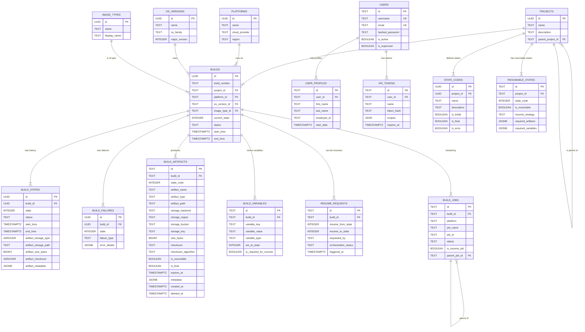

# Database Architecture

This document outlines the database schema for the State-Based Build Framework.

## Overview

The database consists of 17 tables organized into the following logical groups:
- **Platform Configuration**: platforms, os_versions, image_types
- **Project Management**: projects
- **Build Tracking**: builds, build_states, build_failures
- **Authentication & Authorization**: users, user_profiles, api_tokens
- **State Configuration**: state_codes
- **Resumable Builds**: build_artifacts, build_variables, resumable_states, resume_requests, build_jobs

All artifacts are tracked with **SHA256 checksums** for integrity verification, supporting distributed build systems where multiple build servers access shared artifacts from cloud storage (S3, Azure Blob, GCP Storage, NFS, etc.).

## Tables

### Platform Configuration Tables

#### `platforms`

Stores information about cloud platforms.

| Column | Data Type | Constraints | Description |
| :--- | :--- | :--- | :--- |
| `id` | UUID | PRIMARY KEY | UUID |
| `name` | TEXT | NOT NULL, UNIQUE | e.g., 'aws-commercial' |
| `display_name` | TEXT | NOT NULL | e.g., 'AWS Commercial' |
| `cloud_provider` | TEXT | NOT NULL | 'azure', 'aws', 'gcp', etc. |
| `region` | TEXT | NULL | Optional region |
| `created_at` | TIMESTAMPTZ | NOT NULL | ISO UTC timestamp |
| `updated_at` | TIMESTAMPTZ | NOT NULL | ISO UTC timestamp |

### `os_versions`

Stores information about operating system versions.

| Column | Data Type | Constraints | Description |
| :--- | :--- | :--- | :--- |
| `id` | UUID | PRIMARY KEY | UUID |
| `name` | TEXT | NOT NULL, UNIQUE | e.g., 'rhel-8.8' |
| `display_name` | TEXT | NOT NULL | e.g., 'RHEL 8.8' |
| `os_family` | TEXT | NOT NULL | 'rhel', 'sles', 'ubuntu' |
| `major_version` | INTEGER | NOT NULL | |
| `minor_version` | INTEGER | NULL | |
| `created_at` | TIMESTAMPTZ | NOT NULL | ISO UTC timestamp |
| `updated_at` | TIMESTAMPTZ | NOT NULL | ISO UTC timestamp |

### `image_types`

Stores information about image types.

| Column | Data Type | Constraints | Description |
| :--- | :--- | :--- | :--- |
| `id` | UUID | PRIMARY KEY | UUID |
| `name` | TEXT | NOT NULL, UNIQUE | e.g., 'base', 'hana' |
| `display_name` | TEXT | NOT NULL | e.g., 'Base', 'HANA' |
| `description` | TEXT | NULL | |
| `created_at` | TIMESTAMPTZ | NOT NULL | ISO UTC timestamp |
| `updated_at` | TIMESTAMPTZ | NOT NULL | ISO UTC timestamp |

### `projects`

Stores project information and their relationships.

| Column | Data Type | Constraints | Description |
| :--- | :--- | :--- | :--- |
| `id` | UUID | PRIMARY KEY | UUID |
| `name` | TEXT | NOT NULL, UNIQUE | |
| `description` | TEXT | NULL | |
| `parent_project_id` | TEXT | NULL, FOREIGN KEY | Self-referencing to `projects.id` |
| `created_at` | TIMESTAMPTZ | NOT NULL | ISO UTC timestamp |
| `updated_at` | TIMESTAMPTZ | NOT NULL | ISO UTC timestamp |

### `builds`

Main table for build records.

| Column | Data Type | Constraints | Description |
| :--- | :--- | :--- | :--- |
| `id` | UUID | PRIMARY KEY | UUID |
| `build_number` | TEXT | NOT NULL, UNIQUE | |
| `project_id` | TEXT | NULL, FOREIGN KEY | References `projects.id` |
| `platform_id` | TEXT | NOT NULL, FOREIGN KEY | References `platforms.id` |
| `os_version_id` | TEXT | NOT NULL, FOREIGN KEY | References `os_versions.id` |
| `image_type_id` | TEXT | NOT NULL, FOREIGN KEY | References `image_types.id` |
| `current_state` | INTEGER | NOT NULL | 0-100 |
| `status` | TEXT | NOT NULL | 'pending', 'running', etc. |
| `start_time` | TIMESTAMPTZ | NULL | ISO UTC timestamp |
| `end_time` | TIMESTAMPTZ | NULL | ISO UTC timestamp |
| `duration_seconds` | INTEGER | NULL | |
| `packer_manifest` | JSONB | NULL | JSON manifest from Packer |
| `created_by` | TEXT | NULL | |
| `created_at` | TIMESTAMPTZ | NOT NULL | ISO UTC timestamp |
| `updated_at` | TIMESTAMPTZ | NOT NULL | ISO UTC timestamp |

### `build_states`

History of state transitions for each build. Includes artifact storage tracking for quick reference.

| Column | Data Type | Constraints | Description |
| :--- | :--- | :--- | :--- |
| `id` | UUID | PRIMARY KEY | UUID |
| `build_id` | TEXT | NOT NULL, FOREIGN KEY | References `builds.id` |
| `state` | INTEGER | NOT NULL | 0-100 |
| `status` | TEXT | NOT NULL | 'started', 'completed', etc. |
| `start_time` | TIMESTAMPTZ | NOT NULL | ISO UTC timestamp |
| `end_time` | TIMESTAMPTZ | NULL | ISO UTC timestamp |
| `duration_seconds` | INTEGER | NULL | |
| `error_message` | TEXT | NULL | |
| `retry_count` | INTEGER | NULL | |
| `artifact_storage_type` | VARCHAR(50) | NULL, INDEXED | Type: s3, nfs, ebs, ceph, local, etc. |
| `artifact_storage_path` | TEXT | NULL | Full path/URI to stored artifact |
| `artifact_size_bytes` | BIGINT | NULL | Size of artifact in bytes |
| `artifact_checksum` | VARCHAR(128) | NULL | SHA256 or MD5 checksum |
| `artifact_metadata` | JSONB | NULL | Additional artifact metadata |
| `created_at` | TIMESTAMPTZ | NOT NULL | ISO UTC timestamp |

**Relationships:**
- Many-to-one with `builds`

**Note:** The `artifact_storage_*` fields provide quick artifact reference. For full artifact lifecycle management, use the `build_artifacts` table.

### `build_failures`

Detailed failure tracking for builds.

| Column | Data Type | Constraints | Description |
| :--- | :--- | :--- | :--- |
| `id` | TEXT | PRIMARY KEY | UUID |
| `build_id` | TEXT | NOT NULL, FOREIGN KEY | References `builds.id` |
| `state` | INTEGER | NOT NULL | |
| `failure_type` | TEXT | NOT NULL | |
| `error_message` | TEXT | NOT NULL | |
| `error_details` | JSONB | NULL | |
| `component` | TEXT | NULL | |
| `retry_attempt` | INTEGER | NULL | |
| `resolved` | BOOLEAN | NULL | |
| `resolution_notes` | TEXT | NULL | |
| `created_at` | TIMESTAMPTZ | NOT NULL | ISO UTC timestamp |
| `resolved_at` | TIMESTAMPTZ | NULL | |

### Authentication & Authorization Tables

#### `users`

Stores user accounts for authentication and authorization.

| Column | Data Type | Constraints | Description |
| :--- | :--- | :--- | :--- |
| `id` | TEXT | PRIMARY KEY | UUID |
| `username` | TEXT | NOT NULL, UNIQUE, INDEXED | Unique username |
| `email` | TEXT | NOT NULL, UNIQUE, INDEXED | User email address |
| `first_name` | TEXT | NULL | User's first name |
| `last_name` | TEXT | NULL | User's last name |
| `employee_id` | TEXT | NULL | Organization employee ID |
| `hashed_password` | TEXT | NOT NULL | Bcrypt hashed password |
| `is_active` | BOOLEAN | DEFAULT TRUE | Account active status |
| `is_superuser` | BOOLEAN | DEFAULT FALSE | Superuser privileges |
| `created_at` | TIMESTAMPTZ | NOT NULL | ISO UTC timestamp |
| `updated_at` | TIMESTAMPTZ | NULL | ISO UTC timestamp |
| `deactivated_at` | TIMESTAMPTZ | NULL | When account was deactivated |

**Relationships:**
- One-to-many with `user_profiles`
- One-to-many with `api_tokens`

#### `user_profiles`

Extended user profile information from IDM systems.

| Column | Data Type | Constraints | Description |
| :--- | :--- | :--- | :--- |
| `id` | TEXT | PRIMARY KEY | UUID |
| `user_id` | TEXT | NOT NULL, FOREIGN KEY | References `users.id` |
| `first_name` | TEXT | NOT NULL | Profile first name |
| `last_name` | TEXT | NOT NULL | Profile last name |
| `employee_id` | TEXT | NOT NULL | Employee identifier |
| `email` | TEXT | NOT NULL | Profile email |
| `start_date` | TIMESTAMPTZ | NOT NULL | Employment start date |
| `end_date` | TIMESTAMPTZ | NULL | Employment end date |
| `created_at` | TIMESTAMPTZ | NOT NULL | ISO UTC timestamp |

**Relationships:**
- Many-to-one with `users`

#### `api_tokens`

API authentication tokens for programmatic access.

| Column | Data Type | Constraints | Description |
| :--- | :--- | :--- | :--- |
| `id` | TEXT | PRIMARY KEY | UUID |
| `user_id` | TEXT | NOT NULL, FOREIGN KEY | References `users.id` |
| `name` | TEXT | NOT NULL | Token description/name |
| `token_hash` | TEXT | NOT NULL | Hashed API token |
| `scopes` | JSON | NULL | Token permissions/scopes |
| `expires_at` | TIMESTAMPTZ | NULL | Expiration timestamp |
| `is_active` | BOOLEAN | DEFAULT TRUE | Token active status |
| `created_at` | TIMESTAMPTZ | NOT NULL | ISO UTC timestamp |
| `deactivated_at` | TIMESTAMPTZ | NULL | When token was deactivated |

**Relationships:**
- Many-to-one with `users`

### State Configuration Tables

#### `state_codes`

Defines valid state codes for projects with metadata.

| Column | Data Type | Constraints | Description |
| :--- | :--- | :--- | :--- |
| `id` | UUID | PRIMARY KEY | UUID |
| `project_id` | UUID | NOT NULL, FOREIGN KEY | References `projects.id` |
| `name` | TEXT | NOT NULL | State name (e.g., '10_CREATE_VM') |
| `description` | TEXT | NULL | Human-readable description |
| `is_initial` | BOOLEAN | DEFAULT FALSE | Is this an initial state? |
| `is_final` | BOOLEAN | DEFAULT FALSE | Is this a final/terminal state? |
| `is_error` | BOOLEAN | DEFAULT FALSE | Is this an error state? |
| `start_date` | TIMESTAMPTZ | NOT NULL | When this state became valid |
| `end_date` | TIMESTAMPTZ | NULL | When this state was deprecated |

**Relationships:**
- Many-to-one with `projects`

### Resumable Builds Tables

#### `build_artifacts`

Tracks artifacts created during builds for resumption and delivery.

| Column | Data Type | Constraints | Description |
| :--- | :--- | :--- | :--- |
| `id` | TEXT | PRIMARY KEY | UUID |
| `build_id` | TEXT | NOT NULL, FOREIGN KEY | References `builds.id` |
| `state_code` | INTEGER | NOT NULL, INDEXED | State that created artifact |
| `artifact_name` | TEXT | NOT NULL | Artifact identifier |
| `artifact_type` | TEXT | NOT NULL, INDEXED | 'vm_snapshot', 'ami', 'disk_image', etc. |
| `artifact_path` | TEXT | NOT NULL | Full path/URL to artifact |
| `storage_backend` | TEXT | NOT NULL | 's3', 'azure_blob', 'gcp_storage', 'local' |
| `storage_region` | TEXT | NULL | Storage region |
| `storage_bucket` | TEXT | NULL | Bucket/container name |
| `storage_key` | TEXT | NULL | Key/path within bucket |
| `size_bytes` | BIGINT | NULL | Artifact size in bytes |
| `checksum` | TEXT | NULL | SHA256 checksum |
| `checksum_algorithm` | TEXT | DEFAULT 'sha256' | Checksum algorithm |
| `is_resumable` | BOOLEAN | DEFAULT TRUE, INDEXED | Can be used for resume? |
| `is_final` | BOOLEAN | DEFAULT FALSE | Is final deliverable? |
| `expires_at` | TIMESTAMPTZ | NULL, INDEXED | Cleanup time for temp artifacts |
| `metadata` | JSONB | NULL | VM ID, snapshot ID, AMI ID, etc. |
| `created_at` | TIMESTAMPTZ | NOT NULL | ISO UTC timestamp |
| `updated_at` | TIMESTAMPTZ | NOT NULL | ISO UTC timestamp |
| `deleted_at` | TIMESTAMPTZ | NULL, INDEXED | Soft delete timestamp |

**Relationships:**
- Many-to-one with `builds`

**Constraints:**
- Unique constraint on `(build_id, artifact_name)`

#### `build_variables`

Stores build-specific variables needed for resumption (VM IDs, network config, etc.).

| Column | Data Type | Constraints | Description |
| :--- | :--- | :--- | :--- |
| `id` | TEXT | PRIMARY KEY | UUID |
| `build_id` | TEXT | NOT NULL, FOREIGN KEY | References `builds.id` |
| `variable_key` | TEXT | NOT NULL | Variable name |
| `variable_value` | TEXT | NOT NULL | Variable value |
| `variable_type` | TEXT | DEFAULT 'string' | 'string', 'json', 'encrypted' |
| `set_at_state` | INTEGER | NULL | Which state set this variable |
| `is_sensitive` | BOOLEAN | DEFAULT FALSE | Should be encrypted/masked? |
| `is_required_for_resume` | BOOLEAN | DEFAULT FALSE, INDEXED | Required for resumption? |
| `created_at` | TIMESTAMPTZ | NOT NULL | ISO UTC timestamp |
| `updated_at` | TIMESTAMPTZ | NOT NULL | ISO UTC timestamp |

**Relationships:**
- Many-to-one with `builds`

**Constraints:**
- Unique constraint on `(build_id, variable_key)`

#### `resumable_states`

Defines which state codes are resumable and their requirements.

| Column | Data Type | Constraints | Description |
| :--- | :--- | :--- | :--- |
| `id` | TEXT | PRIMARY KEY | UUID |
| `project_id` | TEXT | NOT NULL, FOREIGN KEY | References `projects.id` |
| `state_code` | INTEGER | NOT NULL | State code number |
| `is_resumable` | BOOLEAN | DEFAULT TRUE, INDEXED | Can resume from this state? |
| `resume_strategy` | TEXT | NULL | 'from_artifact', 'rerun_state', 'skip_to_next' |
| `required_artifacts` | JSONB | NULL | Array of required artifact types |
| `required_variables` | JSONB | NULL | Array of required variable keys |
| `resume_command` | TEXT | NULL | Command/script for resumption |
| `resume_timeout_seconds` | INTEGER | DEFAULT 3600 | Timeout for resume operation |
| `description` | TEXT | NULL | Human-readable description |
| `notes` | TEXT | NULL | Additional notes |
| `created_at` | TIMESTAMPTZ | NOT NULL | ISO UTC timestamp |
| `updated_at` | TIMESTAMPTZ | NOT NULL | ISO UTC timestamp |

**Relationships:**
- Many-to-one with `projects`

**Constraints:**
- Unique constraint on `(project_id, state_code)`

#### `resume_requests`

Tracks requests to resume builds and their status.

| Column | Data Type | Constraints | Description |
| :--- | :--- | :--- | :--- |
| `id` | TEXT | PRIMARY KEY | UUID |
| `build_id` | TEXT | NOT NULL, FOREIGN KEY | References `builds.id` |
| `resume_from_state` | INTEGER | NOT NULL | State to resume from |
| `resume_to_state` | INTEGER | NULL | Target state (NULL = completion) |
| `resume_reason` | TEXT | NULL | Reason for resume request |
| `requested_by` | TEXT | NULL | User/system that requested |
| `request_source` | TEXT | NULL | 'api', 'webhook', 'cli', 'auto' |
| `orchestration_job_id` | TEXT | NULL | CI/CD job ID |
| `orchestration_job_url` | TEXT | NULL | CI/CD job URL |
| `orchestration_status` | TEXT | NULL, INDEXED | 'pending', 'triggered', 'running', 'completed', 'failed' |
| `triggered_at` | TIMESTAMPTZ | NULL | When job was triggered |
| `completed_at` | TIMESTAMPTZ | NULL | When job completed |
| `error_message` | TEXT | NULL | Error details if failed |
| `metadata` | JSONB | NULL | Additional metadata |
| `created_at` | TIMESTAMPTZ | NOT NULL, INDEXED | ISO UTC timestamp |
| `updated_at` | TIMESTAMPTZ | NOT NULL | ISO UTC timestamp |

**Relationships:**
- Many-to-one with `builds`

#### `build_jobs`

Links builds to CI/CD job information for tracking and coordination.

| Column | Data Type | Constraints | Description |
| :--- | :--- | :--- | :--- |
| `id` | TEXT | PRIMARY KEY | UUID |
| `build_id` | TEXT | NOT NULL, FOREIGN KEY | References `builds.id` |
| `platform` | TEXT | NOT NULL, INDEXED | 'concourse', 'jenkins', 'github-actions' |
| `pipeline_name` | TEXT | NULL | Pipeline name |
| `job_name` | TEXT | NOT NULL | Job name |
| `job_url` | TEXT | NULL | URL to job in CI/CD system |
| `job_id` | TEXT | NULL, INDEXED | Platform-specific job ID |
| `build_number` | TEXT | NULL | Build number in CI/CD |
| `triggered_by` | TEXT | NULL | Who triggered the job |
| `trigger_source` | TEXT | NULL | 'manual', 'webhook', 'schedule', 'resume' |
| `status` | TEXT | NULL, INDEXED | 'pending', 'running', 'success', 'failed', 'aborted' |
| `started_at` | TIMESTAMPTZ | NULL | Job start time |
| `completed_at` | TIMESTAMPTZ | NULL | Job completion time |
| `is_resume_job` | BOOLEAN | DEFAULT FALSE, INDEXED | Is this a resume job? |
| `resumed_from_state` | INTEGER | NULL | State resumed from |
| `parent_job_id` | TEXT | NULL, FOREIGN KEY | References `build_jobs.id` (self-reference) |
| `created_at` | TIMESTAMPTZ | NOT NULL | ISO UTC timestamp |
| `updated_at` | TIMESTAMPTZ | NOT NULL | ISO UTC timestamp |

**Relationships:**
- Many-to-one with `builds`
- Self-referencing for parent-child job relationships

## Indexes

### Core Build Tables
- `idx_builds_project_id`: on `builds(project_id)`
- `idx_builds_platform_id`: on `builds(platform_id)`
- `idx_builds_os_version_id`: on `builds(os_version_id)`
- `idx_builds_image_type_id`: on `builds(image_type_id)`
- `idx_builds_status`: on `builds(status)`
- `idx_build_states_build_id`: on `build_states(build_id)`
- `idx_build_states_artifact_storage_type`: on `build_states(artifact_storage_type)`
- `idx_build_states_build_id_state`: on `build_states(build_id, state)`
- `idx_build_failures_build_id`: on `build_failures(build_id)`
- `idx_projects_parent_project_id`: on `projects(parent_project_id)`

### Authentication Tables
- `idx_users_username`: on `users(username)` - Unique index
- `idx_users_email`: on `users(email)` - Unique index
- `idx_users_active`: on `users(is_active)` WHERE `is_active = TRUE`
- `idx_user_profiles_user_id`: on `user_profiles(user_id)`
- `idx_user_profiles_employee_id`: on `user_profiles(employee_id)`
- `idx_api_tokens_user_id`: on `api_tokens(user_id)`
- `idx_api_tokens_active`: on `api_tokens(is_active)` WHERE `is_active = TRUE`

### Build Artifacts Tables
- `idx_build_artifacts_build_id`: on `build_artifacts(build_id)`
- `idx_build_artifacts_state_code`: on `build_artifacts(state_code)`
- `idx_build_artifacts_type`: on `build_artifacts(artifact_type)`
- `idx_build_artifacts_resumable`: on `build_artifacts(is_resumable)` WHERE `is_resumable = TRUE`
- `idx_build_artifacts_expires`: on `build_artifacts(expires_at)` WHERE `expires_at IS NOT NULL`
- `idx_build_artifacts_deleted`: on `build_artifacts(deleted_at)` WHERE `deleted_at IS NULL`

### Build Variables Tables
- `idx_build_variables_build_id`: on `build_variables(build_id)`
- `idx_build_variables_required`: on `build_variables(is_required_for_resume)` WHERE `is_required_for_resume = TRUE`

### Resumable States Tables
- `idx_resumable_states_project`: on `resumable_states(project_id)` (when project_id FK exists)
- `idx_resumable_states_resumable`: on `resumable_states(is_resumable)` WHERE `is_resumable = TRUE`

### Resume Requests Tables
- `idx_resume_requests_build_id`: on `resume_requests(build_id)`
- `idx_resume_requests_status`: on `resume_requests(orchestration_status)`
- `idx_resume_requests_created`: on `resume_requests(created_at DESC)`

### Build Jobs Tables
- `idx_build_jobs_build_id`: on `build_jobs(build_id)`
- `idx_build_jobs_platform_job`: on `build_jobs(platform, job_id)`
- `idx_build_jobs_status`: on `build_jobs(status)`
- `idx_build_jobs_is_resume`: on `build_jobs(is_resume_job)` WHERE `is_resume_job = TRUE`

## Database Views

### `build_resume_status`

Aggregated view showing builds with their resume capability.

**Columns:**
- `build_id`: Build UUID
- `build_number`: Build number
- `status`: Build status
- `platform_id`: Platform UUID
- `project_id`: Project UUID
- `artifact_count`: Total artifact count
- `resumable_artifact_count`: Count of resumable artifacts
- `variable_count`: Total variable count
- `required_variable_count`: Count of required variables
- `resume_request_count`: Number of resume requests
- `current_state_code`: Latest state code
- `last_state_change`: Timestamp of last state change

### `latest_resume_requests`

Shows the most recent resume request for each build.

**Columns:** All columns from `resume_requests` table

## Database Functions

### `get_resume_context(p_build_id TEXT)`

Returns comprehensive resume context for a build as JSON.

**Returns:**
```json
{
  "build": {...},  // Full build record
  "artifacts": [...],  // Array of resumable artifacts
  "variables": {...},  // Key-value pairs of variables
  "last_state": 45  // Last completed state code
}
```

**Usage:**
```sql
SELECT get_resume_context('build-uuid-here');
```

## Database Triggers

### `update_updated_at_column()`

Automatically updates the `updated_at` timestamp on row updates.

**Applied to:**
- `build_artifacts`
- `build_variables`
- `resumable_states`
- `resume_requests`
- `build_jobs`

## ERD



## Schema Evolution

This schema has evolved through the following major additions:

1. **Initial Schema** (v1.0): Core build tracking with platforms, OS versions, image types, projects, builds, build states, and build failures
2. **Authentication System** (v1.1): Added users, user_profiles, and api_tokens for authentication and authorization
3. **State Configuration** (v1.2): Added state_codes table for project-specific state definitions
4. **Resumable Builds** (v2.0): Added build_artifacts, build_variables, resumable_states, resume_requests, and build_jobs for comprehensive build resumption support

## Key Design Decisions

### UUID vs. Integer IDs
- Most tables use UUID/TEXT for `id` fields to support distributed systems and avoid ID collisions
- State codes use INTEGER for sequential ordering and human-friendly references

### Artifact Integrity & Checksums
- All artifacts tracked with SHA256 checksums (default algorithm)
- `checksum` field stores the hash value for verification
- `checksum_algorithm` field allows flexibility (sha256, md5, etc.)
- Enables integrity verification when downloading artifacts from storage
- Critical for distributed build systems where artifacts move between servers

### Soft Deletes
- `build_artifacts` uses soft deletes (`deleted_at`) for audit trails
- Users have `deactivated_at` instead of hard deletes
- Preserves history while marking records as inactive

### Indexing Strategy
- Partial indexes on boolean fields (e.g., `WHERE is_resumable = TRUE`) to optimize common queries
- Composite indexes on frequently joined columns (e.g., `platform, job_id`)
- Descending index on `created_at` for recent-first queries
- Artifact storage type indexed for quick lookups by storage backend

### JSON/JSONB Usage
- Flexible metadata storage in `metadata` columns
- Configuration arrays in `required_artifacts` and `required_variables`
- Token scopes stored as JSON for extensibility
- Artifact metadata stores VM IDs, snapshot IDs, AMI IDs, and custom data

### Timestamp Strategy
- All timestamps use `TIMESTAMPTZ` (timestamp with time zone) for global consistency
- `server_default=func.now()` ensures database-level timestamp accuracy
- Separate `created_at` and `updated_at` fields with trigger-based updates

### Dual Artifact Tracking
- **build_states table**: Quick artifact reference for state transitions
- **build_artifacts table**: Full lifecycle management with resumability support
- Provides both performance (quick lookups) and flexibility (comprehensive tracking)
