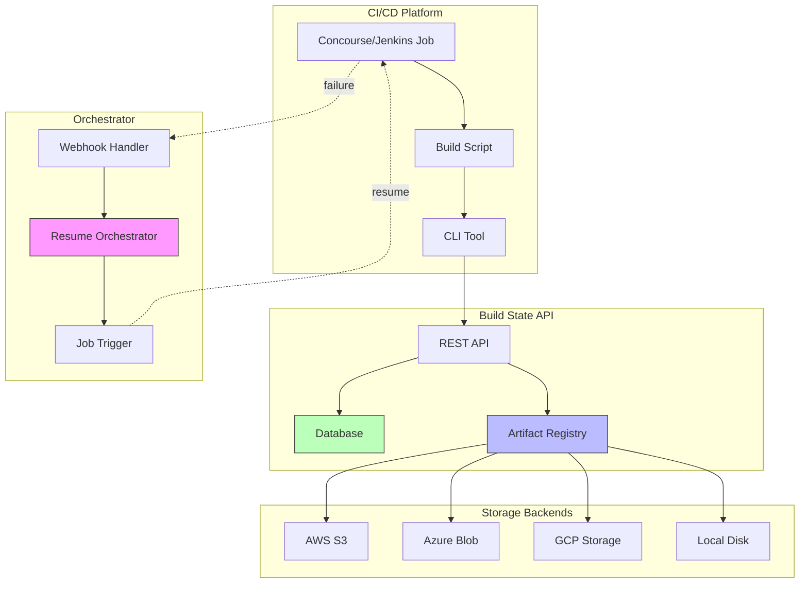
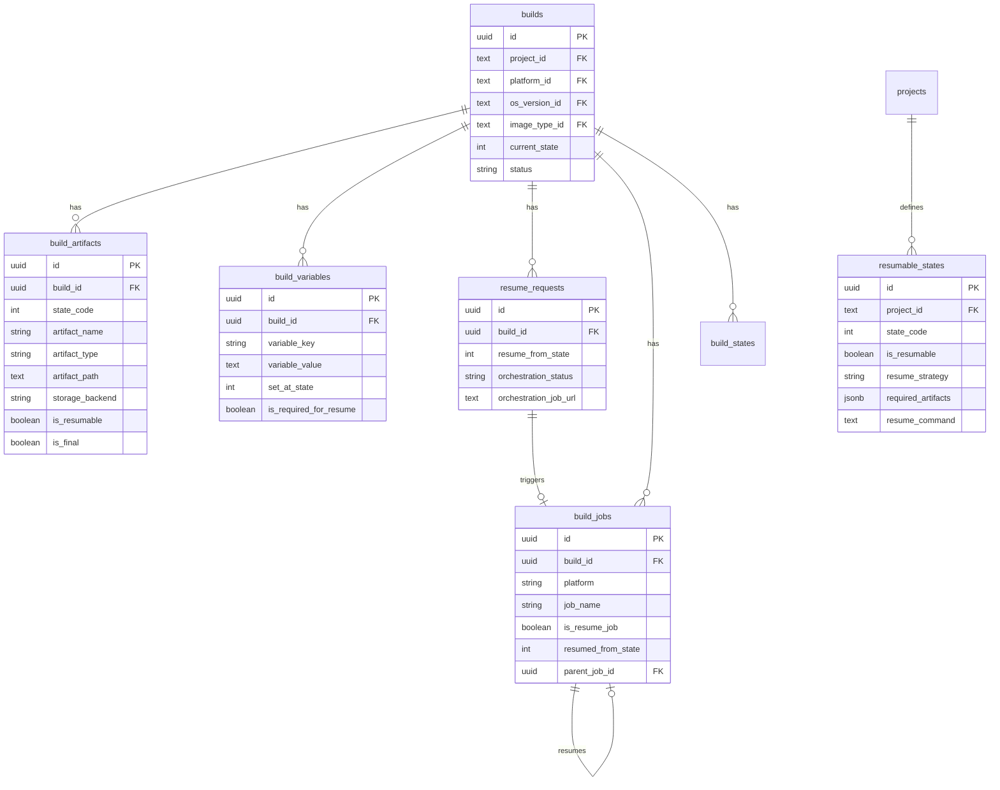
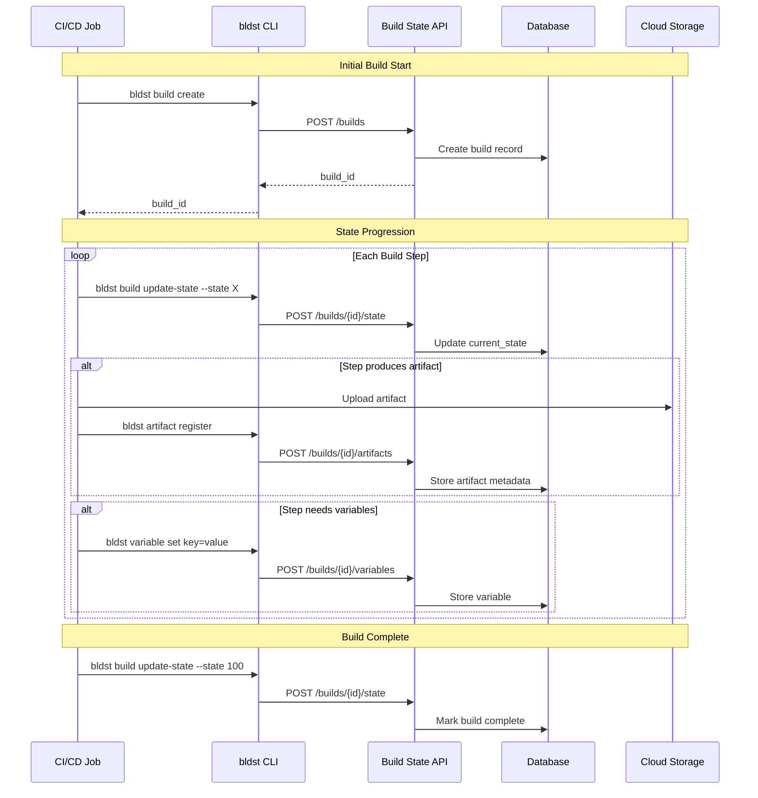
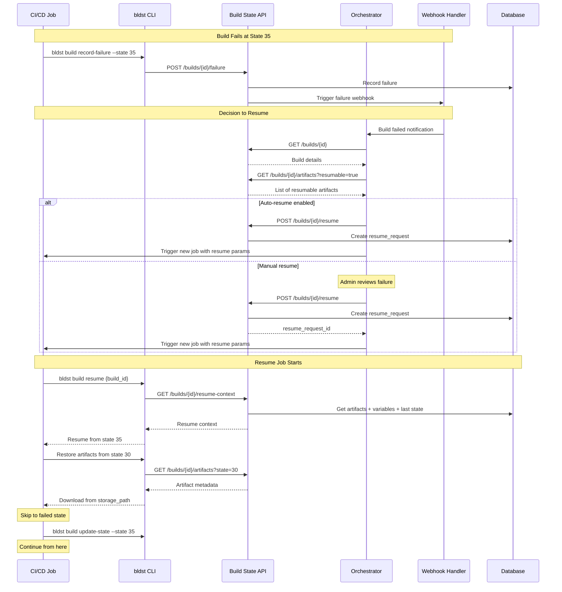
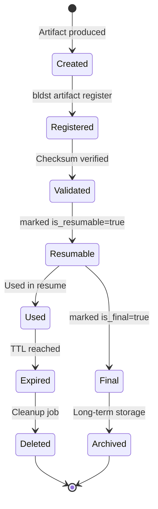
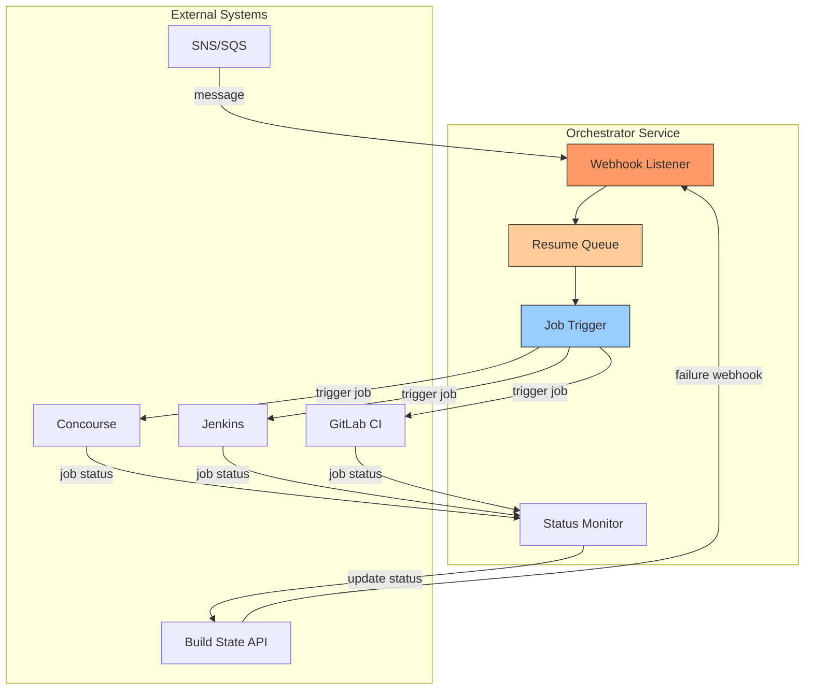

# Resumable Build System - Design Document

## 📋 Executive Summary

This document outlines the design for a resumable build system that enables long-running IaaS VM image builds to recover from failures without restarting from scratch. The system tracks build artifacts, state progression, and provides orchestration capabilities to resume builds from the last successful state.

## 🎯 Problem Statement

### Current Challenges

**Long-Running Monolithic Builds:**
- VM image builds can take 1+ hours to complete
- A single failure means restarting the entire process
- Network issues, quota limits, or transient errors waste hours
- No visibility into which artifacts were successfully created

**Artifacts Without Context:**
- Intermediate VM snapshots are created but not tracked
- Build scripts don't know what artifacts exist from previous runs
- Manual intervention required to resume builds
- Risk of artifact corruption or confusion

### Use Case Example

```
Build Pipeline: RHEL 9 Base Image for AWS
Total Time: ~75 minutes

State 0:  Pending (0 min)
State 5:  Validate configuration (2 min)
State 10: Create base VM (5 min)
State 15: Security hardening (8 min)
State 20: Install packages (15 min)  ← FAILS HERE (network timeout)
State 25: Configure services (10 min)
State 30: Install monitoring (8 min)
State 35: Run tests (12 min)
State 40: Create snapshot (10 min)
State 45: Register AMI (5 min)
State 100: Complete

Without resumability: Start over, waste 30 minutes
With resumability: Resume from State 20, waste 0 minutes
```

## 🏗️ Architecture Overview

### High-Level Components



## 📊 Database Schema Design

### New Tables

#### 1. `build_artifacts` Table

Tracks all artifacts created during a build, with their storage locations and checksums.

```sql
CREATE TABLE build_artifacts (
    id UUID PRIMARY KEY DEFAULT gen_random_uuid(),
    build_id UUID NOT NULL REFERENCES builds(id) ON DELETE CASCADE,
    state_code INTEGER NOT NULL,
    
    -- Artifact identification
    artifact_name VARCHAR(255) NOT NULL,
    artifact_type VARCHAR(50) NOT NULL,  -- 'vm_snapshot', 'ami', 'disk_image', 'config_file', etc.
    artifact_path TEXT NOT NULL,         -- Full path/URL to artifact
    
    -- Storage details
    storage_backend VARCHAR(50) NOT NULL,  -- 's3', 'azure_blob', 'gcp_storage', 'local', 'vsphere'
    storage_region VARCHAR(50),
    storage_bucket VARCHAR(255),
    storage_key TEXT,                     -- Key/path within bucket
    
    -- Artifact metadata
    size_bytes BIGINT,
    checksum VARCHAR(64),                 -- SHA256 checksum
    checksum_algorithm VARCHAR(20) DEFAULT 'sha256',
    
    -- Artifact lifecycle
    is_resumable BOOLEAN DEFAULT TRUE,    -- Can this artifact be used to resume?
    is_final BOOLEAN DEFAULT FALSE,       -- Is this the final deliverable?
    expires_at TIMESTAMP,                 -- When to clean up temporary artifacts
    
    -- Additional metadata as JSON
    metadata JSONB,                       -- VM ID, snapshot ID, AMI ID, etc.
    
    created_at TIMESTAMP DEFAULT NOW(),
    updated_at TIMESTAMP DEFAULT NOW(),
    deleted_at TIMESTAMP,                 -- Soft delete for audit
    
    UNIQUE(build_id, artifact_name)
);

CREATE INDEX idx_build_artifacts_build_id ON build_artifacts(build_id);
CREATE INDEX idx_build_artifacts_state_code ON build_artifacts(state_code);
CREATE INDEX idx_build_artifacts_type ON build_artifacts(artifact_type);
CREATE INDEX idx_build_artifacts_resumable ON build_artifacts(is_resumable) WHERE is_resumable = TRUE;
CREATE INDEX idx_build_artifacts_expires ON build_artifacts(expires_at) WHERE expires_at IS NOT NULL;
```

#### 2. `build_variables` Table

Stores build-specific variables needed for resumption (VM IDs, network config, etc.).

```sql
CREATE TABLE build_variables (
    id UUID PRIMARY KEY DEFAULT gen_random_uuid(),
    build_id UUID NOT NULL REFERENCES builds(id) ON DELETE CASCADE,
    
    -- Variable details
    variable_key VARCHAR(255) NOT NULL,
    variable_value TEXT NOT NULL,
    variable_type VARCHAR(50) DEFAULT 'string',  -- 'string', 'json', 'encrypted'
    
    -- When was this variable set?
    set_at_state INTEGER,                -- Which state code set this variable
    
    -- Variable lifecycle
    is_sensitive BOOLEAN DEFAULT FALSE,  -- Should this be encrypted/masked?
    is_required_for_resume BOOLEAN DEFAULT FALSE,
    
    created_at TIMESTAMP DEFAULT NOW(),
    updated_at TIMESTAMP DEFAULT NOW(),
    
    UNIQUE(build_id, variable_key)
);

CREATE INDEX idx_build_variables_build_id ON build_variables(build_id);
CREATE INDEX idx_build_variables_required ON build_variables(is_required_for_resume) WHERE is_required_for_resume = TRUE;
```

#### 3. `resumable_states` Table

Defines which state codes are resumable and their requirements.

```sql
CREATE TABLE resumable_states (
    id UUID PRIMARY KEY DEFAULT gen_random_uuid(),
    project_id TEXT NOT NULL REFERENCES projects(id),
    state_code INTEGER NOT NULL,
    
    -- Resumability configuration
    is_resumable BOOLEAN DEFAULT TRUE,
    resume_strategy VARCHAR(50),  -- 'from_artifact', 'rerun_state', 'skip_to_next'
    
    -- Requirements for resumption
    required_artifacts JSONB,     -- Array of artifact names/types needed
    required_variables JSONB,     -- Array of variable keys needed
    
    -- Resume script/command
    resume_command TEXT,          -- Command or script to execute on resume
    resume_timeout_seconds INTEGER DEFAULT 3600,
    
    -- Documentation
    description TEXT,
    notes TEXT,
    
    created_at TIMESTAMP DEFAULT NOW(),
    updated_at TIMESTAMP DEFAULT NOW(),
    
    UNIQUE(project_id, state_code)
);

CREATE INDEX idx_resumable_states_project ON resumable_states(project_id);
CREATE INDEX idx_resumable_states_resumable ON resumable_states(is_resumable) WHERE is_resumable = TRUE;
```

#### 4. `resume_requests` Table

Tracks requests to resume builds and their status.

```sql
CREATE TABLE resume_requests (
    id UUID PRIMARY KEY DEFAULT gen_random_uuid(),
    build_id UUID NOT NULL REFERENCES builds(id),
    
    -- Resume details
    resume_from_state INTEGER NOT NULL,
    resume_to_state INTEGER,              -- NULL means resume to completion
    resume_reason TEXT,
    
    -- Request source
    requested_by VARCHAR(255),            -- User/system that requested resume
    request_source VARCHAR(50),           -- 'api', 'webhook', 'cli', 'auto'
    
    -- Orchestration
    orchestration_job_id TEXT,            -- Concourse/Jenkins job ID
    orchestration_job_url TEXT,
    orchestration_status VARCHAR(50),     -- 'pending', 'triggered', 'running', 'completed', 'failed'
    
    -- Execution tracking
    triggered_at TIMESTAMP,
    completed_at TIMESTAMP,
    error_message TEXT,
    
    -- Metadata
    metadata JSONB,
    
    created_at TIMESTAMP DEFAULT NOW(),
    updated_at TIMESTAMP DEFAULT NOW()
);

CREATE INDEX idx_resume_requests_build_id ON resume_requests(build_id);
CREATE INDEX idx_resume_requests_status ON resume_requests(orchestration_status);
CREATE INDEX idx_resume_requests_created ON resume_requests(created_at DESC);
```

#### 5. `build_jobs` Table

Links builds to CI/CD job information.

```sql
CREATE TABLE build_jobs (
    id UUID PRIMARY KEY DEFAULT gen_random_uuid(),
    build_id UUID NOT NULL REFERENCES builds(id),
    
    -- CI/CD platform details
    platform VARCHAR(50) NOT NULL,        -- 'concourse', 'jenkins', 'gitlab-ci', 'github-actions'
    pipeline_name VARCHAR(255),
    job_name VARCHAR(255) NOT NULL,
    job_url TEXT,
    
    -- Job identification
    job_id TEXT,                          -- Platform-specific job ID
    build_number VARCHAR(50),
    
    -- Trigger information
    triggered_by VARCHAR(255),
    trigger_source VARCHAR(50),           -- 'manual', 'webhook', 'schedule', 'resume'
    
    -- Job status
    status VARCHAR(50),                   -- 'pending', 'running', 'success', 'failed', 'aborted'
    started_at TIMESTAMP,
    completed_at TIMESTAMP,
    
    -- Resume context
    is_resume_job BOOLEAN DEFAULT FALSE,
    resumed_from_state INTEGER,
    parent_job_id UUID REFERENCES build_jobs(id),
    
    created_at TIMESTAMP DEFAULT NOW(),
    updated_at TIMESTAMP DEFAULT NOW()
);

CREATE INDEX idx_build_jobs_build_id ON build_jobs(build_id);
CREATE INDEX idx_build_jobs_platform_job ON build_jobs(platform, job_id);
CREATE INDEX idx_build_jobs_status ON build_jobs(status);
```

### Schema Relationships



## 🔄 Build Workflow with Resumability

### Normal Build Flow



### Build Failure and Resume Flow



### Artifact Lifecycle



## 🔌 API Endpoints

### Artifact Management

#### POST `/builds/{build_id}/artifacts`
Register a new artifact for a build.

**Request:**
```json
{
  "state_code": 30,
  "artifact_name": "rhel9-base-snapshot-001",
  "artifact_type": "vm_snapshot",
  "artifact_path": "s3://my-bucket/builds/abc123/snapshot-001.vmdk",
  "storage_backend": "s3",
  "storage_region": "us-east-1",
  "storage_bucket": "my-bucket",
  "storage_key": "builds/abc123/snapshot-001.vmdk",
  "size_bytes": 5368709120,
  "checksum": "a1b2c3d4...",
  "is_resumable": true,
  "is_final": false,
  "expires_at": "2026-02-21T00:00:00Z",
  "metadata": {
    "vm_id": "i-0123456789abcdef",
    "snapshot_id": "snap-0123456789abcdef"
  }
}
```

**Response (201):**
```json
{
  "id": "art-uuid-123",
  "build_id": "build-uuid-456",
  "state_code": 30,
  "artifact_name": "rhel9-base-snapshot-001",
  "artifact_type": "vm_snapshot",
  "artifact_path": "s3://my-bucket/builds/abc123/snapshot-001.vmdk",
  "storage_backend": "s3",
  "is_resumable": true,
  "created_at": "2026-02-14T12:00:00Z"
}
```

#### GET `/builds/{build_id}/artifacts`
List all artifacts for a build.

**Query Parameters:**
- `state_code` (int) - Filter by state code
- `artifact_type` (string) - Filter by type
- `is_resumable` (bool) - Only resumable artifacts
- `is_final` (bool) - Only final artifacts

**Response:**
```json
[
  {
    "id": "art-uuid-123",
    "artifact_name": "rhel9-base-snapshot-001",
    "state_code": 30,
    "artifact_type": "vm_snapshot",
    "storage_backend": "s3",
    "artifact_path": "s3://...",
    "is_resumable": true,
    "metadata": {...}
  }
]
```

#### GET `/builds/{build_id}/artifacts/{artifact_id}`
Get specific artifact details.

#### DELETE `/builds/{build_id}/artifacts/{artifact_id}`
Soft delete an artifact (requires admin scope).

### Variable Management

#### POST `/builds/{build_id}/variables`
Set a build variable.

**Request:**
```json
{
  "variable_key": "vm_instance_id",
  "variable_value": "i-0123456789abcdef",
  "variable_type": "string",
  "set_at_state": 20,
  "is_required_for_resume": true,
  "is_sensitive": false
}
```

#### GET `/builds/{build_id}/variables`
Get all variables for a build.

**Query Parameters:**
- `required_for_resume` (bool) - Only required variables

#### PATCH `/builds/{build_id}/variables/{key}`
Update a variable value.

#### DELETE `/builds/{build_id}/variables/{key}`
Delete a variable.

### Resume Operations

#### POST `/builds/{build_id}/resume`
Request to resume a build.

**Request:**
```json
{
  "resume_from_state": 35,
  "resume_to_state": null,
  "resume_reason": "Network timeout during package installation",
  "requested_by": "ops-team",
  "orchestration_config": {
    "platform": "concourse",
    "pipeline": "rhel9-images",
    "job": "build-base-image",
    "trigger_webhook": "https://concourse.example.com/api/v1/teams/main/pipelines/rhel9-images/jobs/build-base-image/builds"
  }
}
```

**Response (201):**
```json
{
  "resume_request_id": "resume-uuid-789",
  "build_id": "build-uuid-456",
  "resume_from_state": 35,
  "orchestration_status": "pending",
  "created_at": "2026-02-14T13:00:00Z"
}
```

#### GET `/builds/{build_id}/resume-context`
Get everything needed to resume a build.

**Response:**
```json
{
  "build_id": "build-uuid-456",
  "current_state": 30,
  "last_successful_state": 30,
  "failed_state": 35,
  "resume_from_state": 35,
  "artifacts": [
    {
      "state_code": 20,
      "artifact_name": "base-vm",
      "artifact_path": "s3://...",
      "metadata": {...}
    },
    {
      "state_code": 30,
      "artifact_name": "snapshot-001",
      "artifact_path": "s3://...",
      "metadata": {...}
    }
  ],
  "variables": {
    "vm_instance_id": "i-0123456789abcdef",
    "vpc_id": "vpc-0123456789",
    "subnet_id": "subnet-0123456789"
  },
  "resumable_state_config": {
    "resume_strategy": "from_artifact",
    "required_artifacts": ["snapshot-001"],
    "required_variables": ["vm_instance_id"],
    "resume_command": "./scripts/resume-from-snapshot.sh"
  }
}
```

#### GET `/builds/{build_id}/resume-requests`
List all resume requests for a build.

#### GET `/resume-requests/{request_id}`
Get details of a specific resume request.

#### PATCH `/resume-requests/{request_id}`
Update resume request status (for orchestrator).

**Request:**
```json
{
  "orchestration_status": "triggered",
  "orchestration_job_id": "123456",
  "orchestration_job_url": "https://ci.example.com/job/123456",
  "triggered_at": "2026-02-14T13:05:00Z"
}
```

### Resumable State Configuration

#### POST `/projects/{project_id}/resumable-states`
Define which states are resumable.

**Request:**
```json
{
  "state_code": 35,
  "is_resumable": true,
  "resume_strategy": "from_artifact",
  "required_artifacts": ["vm_snapshot", "network_config"],
  "required_variables": ["vm_id", "vpc_id"],
  "resume_command": "./scripts/resume-package-install.sh",
  "resume_timeout_seconds": 3600,
  "description": "Resume package installation from snapshot"
}
```

#### GET `/projects/{project_id}/resumable-states`
List resumable state configurations.

#### GET `/projects/{project_id}/resumable-states/{state_code}`
Get specific resumable state config.

#### PUT `/projects/{project_id}/resumable-states/{state_code}`
Update resumable state configuration.

## 🎮 CLI Commands

### Artifact Commands

```bash
# Register an artifact
bldst artifact register <build-id> \
  --state 30 \
  --name "rhel9-snapshot-001" \
  --type "vm_snapshot" \
  --path "s3://bucket/path/to/snapshot.vmdk" \
  --backend s3 \
  --resumable \
  --metadata '{"vm_id": "i-abc123", "snapshot_id": "snap-xyz789"}'

# List artifacts for a build
bldst artifact list <build-id>

# List only resumable artifacts
bldst artifact list <build-id> --resumable

# Get artifact details
bldst artifact get <build-id> <artifact-id>

# Delete artifact
bldst artifact delete <build-id> <artifact-id>
```

### Variable Commands

```bash
# Set a variable
bldst variable set <build-id> vm_id=i-abc123 \
  --state 20 \
  --required-for-resume

# Set multiple variables
bldst variable set <build-id> \
  vm_id=i-abc123 \
  vpc_id=vpc-xyz789 \
  subnet_id=subnet-123 \
  --state 20

# Get all variables
bldst variable list <build-id>

# Get variable value
bldst variable get <build-id> vm_id

# Delete variable
bldst variable delete <build-id> vm_id
```

### Resume Commands

```bash
# Get resume context (what's needed to resume)
bldst build resume-context <build-id>

# Output in different formats
bldst build resume-context <build-id> --output json
bldst build resume-context <build-id> --output yaml
bldst build resume-context <build-id> --output env  # For sourcing in shell

# Request a resume
bldst build resume <build-id> \
  --from-state 35 \
  --reason "Network timeout during package installation" \
  --platform concourse \
  --pipeline rhel9-images \
  --job build-base-image

# List resume requests
bldst build resume-requests <build-id>

# Check resume request status
bldst resume-request get <request-id>
```

### Resumable State Configuration

```bash
# Define a resumable state for a project
bldst resumable-state create <project-id> \
  --state 35 \
  --strategy from_artifact \
  --required-artifacts "vm_snapshot,network_config" \
  --required-variables "vm_id,vpc_id" \
  --command "./scripts/resume-package-install.sh" \
  --timeout 3600

# List resumable states for project
bldst resumable-state list <project-id>

# Get resumable state config
bldst resumable-state get <project-id> 35

# Update resumable state
bldst resumable-state update <project-id> 35 \
  --timeout 7200
```

## 🤖 Orchestrator Service

### Architecture



### Orchestrator Components

#### 1. Webhook Handler

Receives failure notifications and queues resume requests.

**Endpoints:**
```
POST /webhooks/build-failure
POST /webhooks/sns
POST /webhooks/sqs
```

**Build Failure Webhook Payload:**
```json
{
  "event": "build.failed",
  "build_id": "build-uuid-456",
  "current_state": 35,
  "last_successful_state": 30,
  "failure_reason": "Network timeout",
  "timestamp": "2026-02-14T12:30:00Z",
  "metadata": {
    "ci_platform": "concourse",
    "pipeline": "rhel9-images",
    "job": "build-base-image",
    "build_number": "123"
  }
}
```

#### 2. Resume Queue

Manages pending resume requests with priority and retry logic.

**Features:**
- Priority queue (critical builds first)
- Retry with exponential backoff
- Rate limiting per CI platform
- Dead letter queue for failed resumes

#### 3. Job Trigger

Triggers CI/CD jobs with resume parameters.

**Concourse Example:**
```bash
# Trigger Concourse job with resume params
fly -t main trigger-job \
  --job rhel9-images/build-base-image \
  --var build_id=build-uuid-456 \
  --var resume_mode=true \
  --var resume_from_state=35
```

**Jenkins Example:**
```bash
# Trigger Jenkins job with resume params
curl -X POST \
  "https://jenkins.example.com/job/rhel9-images/job/build-base-image/buildWithParameters" \
  --user token:API_TOKEN \
  --data "BUILD_ID=build-uuid-456" \
  --data "RESUME_MODE=true" \
  --data "RESUME_FROM_STATE=35"
```

#### 4. Status Monitor

Monitors triggered jobs and updates resume request status.

**Polling Strategy:**
- Poll every 30 seconds for running jobs
- Update API with job status
- Detect stalled jobs (no progress for 10 minutes)
- Send alerts on repeated failures

### Orchestrator Configuration

```yaml
orchestrator:
  enabled: true
  workers: 3
  
  queue:
    backend: redis
    max_queue_size: 1000
    retry_attempts: 3
    retry_backoff_seconds: [60, 300, 900]
  
  webhooks:
    enabled: true
    port: 8090
    secret: "${WEBHOOK_SECRET}"
  
  platforms:
    - name: concourse
      enabled: true
      base_url: "https://concourse.example.com"
      team: main
      username: "${CONCOURSE_USER}"
      password: "${CONCOURSE_PASS}"
      rate_limit: 10  # jobs per minute
      
    - name: jenkins
      enabled: true
      base_url: "https://jenkins.example.com"
      username: "${JENKINS_USER}"
      token: "${JENKINS_TOKEN}"
      rate_limit: 5
  
  monitoring:
    enabled: true
    poll_interval_seconds: 30
    stall_timeout_seconds: 600
    
  notifications:
    slack_webhook: "${SLACK_WEBHOOK}"
    email_enabled: false
```

## 📝 Build Script Integration

### Initial Build (with artifact tracking)

```bash
#!/bin/bash
set -euo pipefail

# Configuration
BUILD_ID="${BUILD_ID:-$(uuidgen)}"
PROJECT_ID="rhel9-base"
STATE_CODE=0

# Initialize build
echo "Creating build record..."
BUILD_ID=$(bldst build create \
  --project-id "$PROJECT_ID" \
  --platform-id aws-commercial \
  --os-version-id rhel-9.3 \
  --image-type-id base \
  --build-number "${CI_BUILD_NUMBER}" \
  --output json | jq -r '.id')

echo "Build ID: $BUILD_ID"

# Save build ID for subsequent steps
echo "$BUILD_ID" > /tmp/build_id.txt

# State 5: Validate configuration
STATE_CODE=5
echo "State $STATE_CODE: Validating configuration..."
bldst build update-state "$BUILD_ID" \
  --state $STATE_CODE \
  --status in_progress \
  --message "Validating Packer configuration"

packer validate rhel9-base.pkr.hcl

bldst build update-state "$BUILD_ID" \
  --state $STATE_CODE \
  --status completed \
  --message "Configuration validated"

# State 10: Create base VM
STATE_CODE=10
echo "State $STATE_CODE: Creating base VM..."
bldst build update-state "$BUILD_ID" --state $STATE_CODE --status in_progress

# Start packer build
packer build \
  -var="build_id=$BUILD_ID" \
  -var="build_state=10" \
  rhel9-base.pkr.hcl > /tmp/packer_output.log 2>&1

# Extract VM ID from packer output
VM_ID=$(grep "Created instance" /tmp/packer_output.log | awk '{print $NF}')

# Store VM ID as variable
bldst variable set "$BUILD_ID" vm_id="$VM_ID" \
  --state 10 \
  --required-for-resume

bldst build update-state "$BUILD_ID" --state $STATE_CODE --status completed

# State 20: Install packages (long-running, resumable)
STATE_CODE=20
echo "State $STATE_CODE: Installing packages..."
bldst build update-state "$BUILD_ID" --state $STATE_CODE --status in_progress

# This might fail due to network issues
if ! ansible-playbook -i "$VM_ID," install-packages.yml; then
  echo "Package installation failed!"
  
  # Record failure
  bldst build record-failure "$BUILD_ID" \
    --state $STATE_CODE \
    --error "Package installation failed" \
    --retryable
  
  exit 1
fi

# Create snapshot after successful package installation
SNAPSHOT_ID=$(aws ec2 create-snapshot \
  --volume-id vol-xyz \
  --description "Build $BUILD_ID state 20" \
  --query 'SnapshotId' \
  --output text)

# Register artifact
bldst artifact register "$BUILD_ID" \
  --state 20 \
  --name "packages-installed-snapshot" \
  --type "ebs_snapshot" \
  --path "aws://snapshot/$SNAPSHOT_ID" \
  --backend aws \
  --resumable \
  --metadata "{\"snapshot_id\": \"$SNAPSHOT_ID\", \"vm_id\": \"$VM_ID\"}"

bldst build update-state "$BUILD_ID" --state $STATE_CODE --status completed

# Continue with remaining states...
```

### Resume Build Script

```bash
#!/bin/bash
set -euo pipefail

# This script is triggered by the orchestrator with resume parameters
BUILD_ID="${BUILD_ID}"
RESUME_MODE="${RESUME_MODE:-false}"
RESUME_FROM_STATE="${RESUME_FROM_STATE:-0}"

echo "Build ID: $BUILD_ID"
echo "Resume Mode: $RESUME_MODE"
echo "Resume From State: $RESUME_FROM_STATE"

if [ "$RESUME_MODE" = "true" ]; then
  echo "===== RESUMING BUILD ====="
  
  # Get resume context
  RESUME_CONTEXT=$(bldst build resume-context "$BUILD_ID" --output json)
  
  # Extract last successful state
  LAST_STATE=$(echo "$RESUME_CONTEXT" | jq -r '.last_successful_state')
  echo "Last successful state: $LAST_STATE"
  
  # Get variables
  VM_ID=$(echo "$RESUME_CONTEXT" | jq -r '.variables.vm_id')
  SNAPSHOT_ID=$(echo "$RESUME_CONTEXT" | jq -r '.variables.snapshot_id // empty')
  
  echo "Restored variables:"
  echo "  VM_ID: $VM_ID"
  echo "  SNAPSHOT_ID: $SNAPSHOT_ID"
  
  # Get last snapshot artifact
  if [ "$RESUME_FROM_STATE" -ge 20 ]; then
    SNAPSHOT_ARTIFACT=$(echo "$RESUME_CONTEXT" | \
      jq -r '.artifacts[] | select(.state_code == 20 and .artifact_type == "ebs_snapshot") | .metadata.snapshot_id')
    
    if [ -n "$SNAPSHOT_ARTIFACT" ]; then
      echo "Restoring from snapshot: $SNAPSHOT_ARTIFACT"
      
      # Create volume from snapshot
      VOLUME_ID=$(aws ec2 create-volume \
        --snapshot-id "$SNAPSHOT_ARTIFACT" \
        --availability-zone us-east-1a \
        --query 'VolumeId' \
        --output text)
      
      # Attach to instance
      aws ec2 attach-volume \
        --volume-id "$VOLUME_ID" \
        --instance-id "$VM_ID" \
        --device /dev/sdf
      
      echo "Volume attached. Waiting for it to be available..."
      aws ec2 wait volume-in-use --volume-ids "$VOLUME_ID"
    fi
  fi
  
  # Skip to the failed state
  START_STATE=$RESUME_FROM_STATE
else
  echo "===== STARTING NEW BUILD ====="
  START_STATE=0
fi

# Execute states from START_STATE onwards
case $START_STATE in
  0|5|10)
    # Run states 0-10 if not resuming
    run_state_10
    run_state_20
    run_state_30
    # ... etc
    ;;
  20)
    # Resume from state 20
    echo "Resuming from package installation..."
    run_state_20
    run_state_30
    # ... etc
    ;;
  30)
    # Resume from state 30
    echo "Resuming from configuration..."
    run_state_30
    run_state_40
    # ... etc
    ;;
esac

echo "Build completed!"
```

## 🎯 Implementation Phases

### Phase 1: Database & Core API (Week 1-2)
- [ ] Create database migration for new tables
- [ ] Implement artifact management endpoints
- [ ] Implement variable management endpoints
- [ ] Add unit tests for new models and endpoints

### Phase 2: CLI Integration (Week 2-3)
- [ ] Add artifact commands to CLI
- [ ] Add variable commands to CLI
- [ ] Add resume-context command to CLI
- [ ] Update CLI documentation

### Phase 3: Resume API (Week 3-4)
- [ ] Implement resume request endpoints
- [ ] Implement resumable state configuration
- [ ] Add resume-context aggregation logic
- [ ] Add integration tests

### Phase 4: Orchestrator Service (Week 4-6)
- [ ] Build webhook handler
- [ ] Implement resume queue
- [ ] Build job triggers for Concourse/Jenkins
- [ ] Add status monitoring
- [ ] Deploy as separate service

### Phase 5: Example Scripts & Documentation (Week 6-7)
- [ ] Create example build scripts
- [ ] Create example resume scripts
- [ ] Write integration guide
- [ ] Create video walkthrough

### Phase 6: Production Hardening (Week 7-8)
- [ ] Add monitoring and alerting
- [ ] Performance testing with large builds
- [ ] Security audit
- [ ] Production deployment guide

## 🔍 Example Scenarios

### Scenario 1: Network Timeout During Package Installation

**Initial Build:**
- State 0-15: Success (prep work)
- State 20: FAIL (network timeout installing packages)

**Resume Flow:**
1. Orchestrator detects failure at state 20
2. Queries API for last successful state (15)
3. Gets artifact from state 15 (base VM snapshot)
4. Triggers new job with:
   - `BUILD_ID` (same as original)
   - `RESUME_MODE=true`
   - `RESUME_FROM_STATE=20`
5. New job:
   - Restores snapshot from state 15
   - Skips states 0-15
   - Retries state 20
   - Continues to completion

**Time Saved:** 15 minutes (prep) + 5 minutes (VM creation) = 20 minutes

### Scenario 2: Configuration Error at State 60

**Initial Build:**
- States 0-55: Success (VM built, packages installed)
- State 60: FAIL (Ansible configuration error)

**Resume Flow:**
1. Engineer fixes Ansible playbook
2. Manually requests resume via CLI:
   ```bash
   bldst build resume build-xyz \
     --from-state 60 \
     --reason "Fixed Ansible syntax error"
   ```
3. Orchestrator triggers job with resume params
4. Job restores from snapshot at state 55
5. Reruns state 60 with fixed playbook
6. Continues to completion

**Time Saved:** ~40 minutes (all previous states)

### Scenario 3: Quota Limit During AMI Registration

**Initial Build:**
- States 0-90: Success (VM fully built and tested)
- State 95: FAIL (AWS AMI quota exceeded)

**Resume Flow:**
1. Ops team increases AMI quota
2. Build auto-resumes after 1 hour (configurable)
3. Job gets snapshot from state 90
4. Skips to state 95 (AMI registration)
5. Successfully registers AMI
6. Complete

**Time Saved:** ~60 minutes (entire build except final step)

## 📈 Success Metrics

### Metrics to Track

1. **Resume Success Rate**
   - % of resumes that complete successfully
   - Target: >90%

2. **Time Savings**
   - Average time saved per resume
   - Total hours saved per month
   - Target: 20+ hours/month

3. **Build Recovery Rate**
   - % of failed builds successfully resumed
   - Target: >80%

4. **Artifact Storage**
   - Total storage used for artifacts
   - Storage cost per build
   - Cleanup effectiveness

5. **Resume Latency**
   - Time from failure to resume trigger
   - Time from resume trigger to job start
   - Target: <5 minutes

### API Metrics Endpoints

```bash
# Resume statistics
GET /metrics/resumes/stats

# Time savings
GET /metrics/resumes/time-saved?period=30d

# Storage usage
GET /metrics/artifacts/storage-usage

# Success rates
GET /metrics/builds/resume-success-rate?period=7d
```

## 🤔 Design Decisions & Trade-offs

### 1. Artifact Storage Strategy

**Decision:** Store artifact metadata in database, actual files in cloud storage

**Rationale:**
- Database stores paths, checksums, and metadata
- Actual artifacts in S3/Azure/GCP for scalability
- Deduplication happens at storage layer
- Easy to implement cleanup policies

**Trade-offs:**
- Additional storage costs
- Need to manage lifecycle policies
- Network transfer time on resume

### 2. State Granularity

**Decision:** Not all states need to be resumable

**Rationale:**
- Quick states (<5 min) can just re-run
- Focus on long-running states (>10 min)
- Reduces artifact storage costs
- Simpler resume logic

**Trade-offs:**
- Some time wasted re-running quick states
- Need clear documentation on which states are resumable

### 3. Orchestrator as Separate Service

**Decision:** Build orchestrator as independent service

**Rationale:**
- Can scale independently
- Doesn't affect API availability
- Can support multiple CI/CD platforms
- Easier to deploy in different environments

**Trade-offs:**
- Another service to maintain
- Additional deployment complexity
- Need message queue/webhooks for communication

### 4. Checksum Verification

**Decision:** Store SHA256 checksums for all artifacts

**Rationale:**
- Detect corrupted artifacts before resume
- Security benefit (detect tampering)
- Relatively fast to compute

**Trade-offs:**
- CPU cost to calculate checksums
- Storage for checksum values
- Resume fails if checksum mismatch

### 5. Variable Storage

**Decision:** Store all variables in database, not as artifact files

**Rationale:**
- Fast access (no file download)
- Easy to query and update
- Support for sensitive values (encryption)
- Version history built-in

**Trade-offs:**
- Limited to simple key-value pairs
- Large values (>1MB) need special handling
- Can't easily restore from file backup

## 🚀 Next Steps

1. **Review this design document** with team
2. **Prioritize use cases** (which types of builds benefit most?)
3. **Choose initial CI/CD platform** (Concourse? Jenkins?)
4. **Define resumable states** for pilot project
5. **Start Phase 1 implementation** (database schema)

## 📚 References

- [FastAPI Documentation](https://fastapi.tiangolo.com/)
- [Packer Build Artifacts](https://www.packer.io/docs/builders)
- [Concourse Resources](https://concourse-ci.org/resources.html)
- [AWS EC2 Snapshots](https://docs.aws.amazon.com/AWSEC2/latest/UserGuide/EBSSnapshots.html)
- [Azure Managed Disks](https://docs.microsoft.com/en-us/azure/virtual-machines/managed-disks-overview)

---

**Document Version:** 1.0  
**Last Updated:** February 14, 2026  
**Status:** Design/Planning Phase  
**Next Review:** After team feedback
