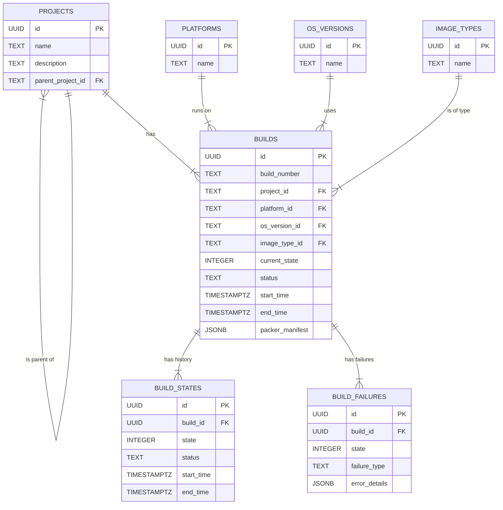

# Database Architecture

This document outlines the database schema for the State-Based Build Framework.

## Tables

### `platforms`

Stores information about cloud platforms.

| Column | Data Type | Constraints | Description |
| :--- | :--- | :--- | :--- |
| `id` | UUID | PRIMARY KEY | UUID |
| `name` | TEXT | NOT NULL, UNIQUE | e.g., 'aws-commercial' |
| `display_name` | TEXT | NOT NULL | e.g., 'AWS Commercial' |
| `cloud_provider` | TEXT | NOT NULL | 'azure', 'aws', 'gcp', etc. |
| `region` | TEXT | NULL | Optional region |
| `created_at` | TIMESTAMPTZ | NOT NULL | ISO UTC timestamp |
| `updated_at` | TIMESTAMPTZ | NOT NULL | ISO UTC timestamp |

### `os_versions`

Stores information about operating system versions.

| Column | Data Type | Constraints | Description |
| :--- | :--- | :--- | :--- |
| `id` | UUID | PRIMARY KEY | UUID |
| `name` | TEXT | NOT NULL, UNIQUE | e.g., 'rhel-8.8' |
| `display_name` | TEXT | NOT NULL | e.g., 'RHEL 8.8' |
| `os_family` | TEXT | NOT NULL | 'rhel', 'sles', 'ubuntu' |
| `major_version` | INTEGER | NOT NULL | |
| `minor_version` | INTEGER | NULL | |
| `created_at` | TIMESTAMPTZ | NOT NULL | ISO UTC timestamp |
| `updated_at` | TIMESTAMPTZ | NOT NULL | ISO UTC timestamp |

### `image_types`

Stores information about image types.

| Column | Data Type | Constraints | Description |
| :--- | :--- | :--- | :--- |
| `id` | UUID | PRIMARY KEY | UUID |
| `name` | TEXT | NOT NULL, UNIQUE | e.g., 'base', 'hana' |
| `display_name` | TEXT | NOT NULL | e.g., 'Base', 'HANA' |
| `description` | TEXT | NULL | |
| `created_at` | TIMESTAMPTZ | NOT NULL | ISO UTC timestamp |
| `updated_at` | TIMESTAMPTZ | NOT NULL | ISO UTC timestamp |

### `projects`

Stores project information and their relationships.

| Column | Data Type | Constraints | Description |
| :--- | :--- | :--- | :--- |
| `id` | UUID | PRIMARY KEY | UUID |
| `name` | TEXT | NOT NULL, UNIQUE | |
| `description` | TEXT | NULL | |
| `parent_project_id` | TEXT | NULL, FOREIGN KEY | Self-referencing to `projects.id` |
| `created_at` | TIMESTAMPTZ | NOT NULL | ISO UTC timestamp |
| `updated_at` | TIMESTAMPTZ | NOT NULL | ISO UTC timestamp |

### `builds`

Main table for build records.

| Column | Data Type | Constraints | Description |
| :--- | :--- | :--- | :--- |
| `id` | UUID | PRIMARY KEY | UUID |
| `build_number` | TEXT | NOT NULL, UNIQUE | |
| `project_id` | TEXT | NULL, FOREIGN KEY | References `projects.id` |
| `platform_id` | TEXT | NOT NULL, FOREIGN KEY | References `platforms.id` |
| `os_version_id` | TEXT | NOT NULL, FOREIGN KEY | References `os_versions.id` |
| `image_type_id` | TEXT | NOT NULL, FOREIGN KEY | References `image_types.id` |
| `current_state` | INTEGER | NOT NULL | 0-100 |
| `status` | TEXT | NOT NULL | 'pending', 'running', etc. |
| `start_time` | TIMESTAMPTZ | NULL | ISO UTC timestamp |
| `end_time` | TIMESTAMPTZ | NULL | ISO UTC timestamp |
| `duration_seconds` | INTEGER | NULL | |
| `packer_manifest` | JSONB | NULL | JSON manifest from Packer |
| `created_by` | TEXT | NULL | |
| `created_at` | TIMESTAMPTZ | NOT NULL | ISO UTC timestamp |
| `updated_at` | TIMESTAMPTZ | NOT NULL | ISO UTC timestamp |

### `build_states`

History of state transitions for each build.

| Column | Data Type | Constraints | Description |
| :--- | :--- | :--- | :--- |
| `id` | UUID | PRIMARY KEY | UUID |
| `build_id` | TEXT | NOT NULL, FOREIGN KEY | References `builds.id` |
| `state` | INTEGER | NOT NULL | 0-100 |
| `status` | TEXT | NOT NULL | 'started', 'completed', etc. |
| `start_time` | TIMESTAMPTZ | NOT NULL | ISO UTC timestamp |
| `end_time` | TIMESTAMPTZ | NULL | ISO UTC timestamp |
| `duration_seconds` | INTEGER | NULL | |
| `error_message` | TEXT | NULL | |
| `retry_count` | INTEGER | NULL | |
| `created_at` | TIMESTAMPTZ | NOT NULL | ISO UTC timestamp |

### `build_failures`

Detailed failure tracking for builds.

| Column | Data Type | Constraints | Description |
| :--- | :--- | :--- | :--- |
| `id` | TEXT | PRIMARY KEY | UUID |
| `build_id` | TEXT | NOT NULL, FOREIGN KEY | References `builds.id` |
| `state` | INTEGER | NOT NULL | |
| `failure_type` | TEXT | NOT NULL | |
| `error_message` | TEXT | NOT NULL | |
| `error_details` | JSONB | NULL | |
| `component` | TEXT | NULL | |
| `retry_attempt` | INTEGER | NULL | |
| `resolved` | BOOLEAN | NULL | |
| `resolution_notes` | TEXT | NULL | |
| `created_at` | TIMESTAMPTZ | NOT NULL | ISO UTC timestamp |
| `resolved_at` | TIMESTAMPTZ | NULL | |

## Indexes

- `idx_builds_project_id`: on `builds(project_id)`
- `idx_builds_platform_id`: on `builds(platform_id)`
- `idx_builds_os_version_id`: on `builds(os_version_id)`
- `idx_builds_image_type_id`: on `builds(image_type_id)`
- `idx_build_states_build_id`: on `build_states(build_id)`
- `idx_build_failures_build_id`: on `build_failures(build_id)`
- `idx_projects_parent_project_id`: on `projects(parent_project_id)`

## ERD

