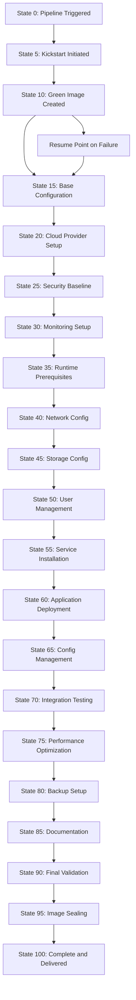

# State-Based Build Framework for Multi-Cloud IaaS Image Creation

## Overview

This framework introduces a standardized state code system for building IaaS images across multiple cloud providers (AWS, Azure, GCP, private clouds, etc.) using Packer, Ansible, and Cloud Foundry Concourse pipelines. By assigning numerical state codes to build milestones, we achieve:

- **Resumable Pipelines**: Failed builds can resume from the last completed state
- **Cross-Platform Communication**: Unambiguous status reporting across all cloud providers
- **Scalable Architecture**: State codes increment by 5s, allowing insertion of new steps without renumbering
- **Process Transparency**: Clear milestones from initial setup (state 0) to delivery (state 100)
- **Centralized Tracking**: FastAPI service for data management, dashboarding, and reporting
- **CLI Tooling**: Command-line interface for easy interaction and automation

## Architecture

The framework consists of three main components:

### 1. FastAPI Service (`../api_service/`)
- **REST API** for build state management
- **User authentication** and API token management
- **Database persistence** with PostgreSQL/SQLite
- **Caching** with Redis for performance
- **Health monitoring** and readiness checks
- **Dashboard endpoints** for reporting and analytics

### 2. CLI Tool (`../buildstate_cli/`)
- **Command-line interface** for service interaction
- **User and token management** commands
- **Build lifecycle management** (create, update, query)
- **Authentication handling** (login, token management)
- **Rich output formatting** for better UX

### 3. Documentation (`problem_statement/`)
- **Framework concepts** and state definitions
- **Implementation guides** and examples
- **Failure handling** strategies
- **Storage architecture** options

## State Code System

State codes range from 0 (nothing) to 100 (complete and delivered), incrementing by 5 to allow for future enhancements.

### State Definitions

| State Code | Description | Tools Involved | Notes |
|------------|-------------|----------------|-------|
| 0 | Initial state - No work started | - | Pipeline triggered |
| 5 | Kickstart initiated - Base image creation started | Packer | OS installation begins |
| 10 | Green image created - Minimally bootable image | Packer, Kickstart | Bootable, default user, SSH key auth enabled |
| 15 | Base configuration applied | Ansible | Basic system hardening, package updates |
| 20 | Cloud provider specific setup | Ansible | Provider-specific configurations (e.g., AWS CLI, Azure agent) |
| 25 | Security baseline applied | Ansible | Firewall rules, SELinux/AppArmor, security patches |
| 30 | Monitoring and logging setup | Ansible | Install agents (CloudWatch, Azure Monitor, etc.) |
| 35 | Application runtime prerequisites | Ansible | Java, Python, Node.js, etc. based on image type |
| 40 | Network configuration | Ansible | DNS, proxies, VPN setup if needed |
| 45 | Storage configuration | Ansible | Mount points, disk partitioning, cloud storage integration |
| 50 | User management and authentication | Ansible | Additional users, sudo configs, LDAP/AD integration |
| 55 | Service installation | Ansible | Web servers, databases, application servers |
| 60 | Application deployment | Ansible | Deploy specific applications or frameworks |
| 65 | Configuration management | Ansible | Environment-specific configs, secrets management |
| 70 | Integration testing | Ansible, custom scripts | Basic functionality tests |
| 75 | Performance optimization | Ansible | Tuning, caching, resource allocation |
| 80 | Backup and recovery setup | Ansible | Backup agents, snapshot configurations |
| 85 | Documentation and metadata | Ansible | Update image metadata, create documentation |
| 90 | Final validation | Custom scripts | Comprehensive tests, compliance checks |
| 95 | Image sealing and cleanup | Packer/Ansible | Remove temporary files, seal image |
| 100 | Complete and delivered | Cloud provider APIs | Image published and available |

### State Transition Rules

**Successful Completion**: State advances to next milestone (e.g., 5 → 10)

**Failure Handling**: 
- **Stay at current state code** but mark as "failed"
- **Do not rollback** to previous state (preserves progress indication)
- **Retry logic** can attempt the same state multiple times
- **Manual intervention** may be required for certain failures

**Example**:
- Build reaches state 5 (kickstart initiated)
- Kickstart fails due to network timeout
- State remains at 5, but status becomes "failed"
- On retry/resume, system attempts state 5 again
- If successful, advances to state 10

This approach ensures:
- Progress is never lost (you know you got past state 0)
- Failed states are clearly identified for debugging
- Retry logic can be implemented per state
- Manual intervention is possible when automated retry fails

## Failure Handling: Stay vs. Rollback

**Question**: If state 5 fails, should we return to state 0, stay at 5, or use "5-" to indicate partial completion?

**Answer**: **Stay at the current state code but mark as failed**. Do not rollback to previous states.

### Why Stay at Failed State?

Your current approach of starting completely over works for simple, fast builds. However, for complex multi-cloud image creation with long-running steps (kickstart can take 30+ minutes), losing all progress is expensive.

**Example Scenario**:
- Build reaches state 5 (kickstart initiated) - 15 minutes elapsed
- Kickstart fails due to network timeout
- **Old approach**: Start over from state 0, lose 15 minutes
- **New approach**: Stay at state 5 (failed), retry kickstart - only lose the failed attempt time

### State vs. Status Separation

The framework separates **state codes** (progress milestones) from **status** (success/failure of that milestone):

```
State 5: "Kickstart initiated" (the milestone/target)
Status: "completed", "failed", "in_progress" (whether that target was achieved)
```

**Failure Example**:
- State remains: 5 (you did reach the kickstart milestone, even if it failed)
- Status becomes: "failed" (but you know you attempted it)
- History shows: Multiple attempts at state 5 with failure reasons

### Migration from Current System

For your existing non-transactional scripts, you can gradually adopt this approach:

1. **Phase 1**: Add state tracking but keep current retry logic
2. **Phase 2**: Implement selective retry for expensive operations (kickstart, large downloads)
3. **Phase 3**: Add intelligent retry strategies per state type

This gives you resumability benefits while maintaining compatibility with your current "start over" approach for simpler states.

## Process Flow



## State Storage Architecture

### Requirements
- Persistent across pipeline restarts
- Accessible from any cloud provider environment
- Supports concurrent builds (unique per build ID)
- Lightweight and fast
- Supports metadata storage (timestamps, error logs, etc.)

### Recommended Storage Options

#### Primary: SQLite Database
- **Pros**: Local file-based, ACID compliant, SQL queries, no external dependencies
- **Cons**: Single-writer limitation, file locking issues in distributed environments
- **Use Case**: Single Concourse worker, local storage

#### Secondary: JSON File on Shared Storage
- **Pros**: Simple, human-readable, easy backup, works with S3/Blob storage
- **Cons**: No concurrency control, manual locking required
- **Use Case**: Simple deployments, read-heavy scenarios

#### Tertiary: DynamoDB (AWS) / CosmosDB (Azure) / Firestore (GCP)
- **Pros**: Highly available, scalable, built-in concurrency control
- **Cons**: Vendor lock-in, requires cloud credentials
- **Use Case**: Multi-cloud with primary cloud provider

#### Hybrid: Local SQLite with Cloud Backup
- **Pros**: Fast local access, cloud durability
- **Cons**: Synchronization complexity
- **Use Case**: Best of both worlds

### State Record Structure
```json
{
  "buildId": "sap-image-2024-01-15-001",
  "currentState": 45,
  "cloudProvider": "aws",
  "imageType": "rhel8-webserver",
  "startTime": "2024-01-15T10:00:00Z",
  "lastUpdate": "2024-01-15T12:30:00Z",
  "stateHistory": [
    {"state": 0, "timestamp": "2024-01-15T10:00:00Z", "status": "completed"},
    {"state": 5, "timestamp": "2024-01-15T10:05:00Z", "status": "completed"},
    {"state": 10, "timestamp": "2024-01-15T10:15:00Z", "status": "completed"},
    {"state": 15, "timestamp": "2024-01-15T10:20:00Z", "status": "completed"},
    {"state": 20, "timestamp": "2024-01-15T10:25:00Z", "status": "completed"},
    {"state": 25, "timestamp": "2024-01-15T10:30:00Z", "status": "completed"},
    {"state": 30, "timestamp": "2024-01-15T10:35:00Z", "status": "completed"},
    {"state": 35, "timestamp": "2024-01-15T10:40:00Z", "status": "completed"},
    {"state": 40, "timestamp": "2024-01-15T10:45:00Z", "status": "completed"},
    {"state": 45, "timestamp": "2024-01-15T11:00:00Z", "status": "in_progress"}
  ],
  "metadata": {
    "packerVersion": "1.9.1",
    "ansibleVersion": "2.15.0",
    "baseImage": "rhel-8.7-x86_64",
    "targetRegions": ["us-east-1", "eu-west-1"]
  },
  "errorLogs": [],
  "resumeToken": "abc123xyz"
}
```

## Implementation Guidelines

### Pipeline Integration
1. **State Check**: At pipeline start, query current state for build ID
2. **Resume Logic**: Jump to appropriate pipeline stage based on state
3. **State Updates**: Update state after each successful milestone
4. **Error Handling**: On failure, log error and maintain current state for resume
5. **Cleanup**: On successful completion, archive state record

### Ansible Integration
- Use Ansible callbacks to update state on task completion
- Store state in Ansible facts for access across plays
- Implement idempotent tasks for safe resuming

### Packer Integration
- Use Packer's `post-processor` to update state after image creation
- Store state in Packer's user variables

### Concourse Pipeline Structure
```yaml
jobs:
- name: build-image
  plan:
  - get: source-code
  - task: check-state
    config:
      inputs: [source-code]
      run:
        path: ./scripts/check-build-state.sh
  - task: kickstart
    config:
      run:
        path: ./scripts/run-kickstart.sh
    on_failure:
      put: state-store
      params: {state: current}
  - task: ansible-config
    # ... subsequent tasks
```

## Benefits

1. **Resumability**: Failed builds can restart from last good state
2. **Visibility**: Clear status across all cloud providers
3. **Maintainability**: Standardized process reduces snowflake configurations
4. **Scalability**: Easy to add new states without breaking existing pipelines
5. **Debugging**: State history provides audit trail for troubleshooting
6. **Resource Efficiency**: Avoid re-running completed steps

## Migration Path

1. Start with pilot project on one cloud provider
2. Implement state storage and basic state management
3. Gradually migrate existing pipelines to use state codes
4. Add monitoring and alerting based on state transitions
5. Expand to additional cloud providers

## Future Enhancements

- State-based rollback capabilities
- Parallel state execution for independent steps
- State prediction using ML for ETA calculations
- Integration with CI/CD tools for automated state reporting
- State-based cost tracking per build phase